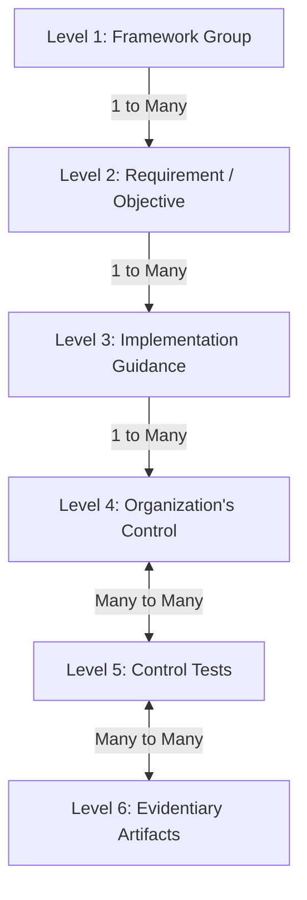
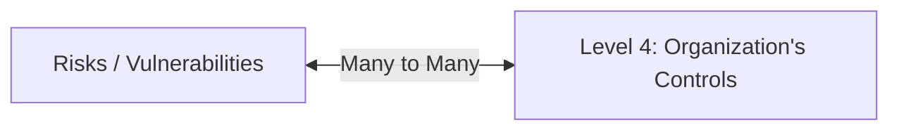

# Lifeboat

Development status: Requirements definition.

Lifeboat is the working name for a lightweight, self-hosted, open-source GRC solution.

**Contributions to this README and the requirements document will be appreciated. Please feel free to propose changes via a PR or open an issue for discussion. Note that by making a contribution you agree that it falls under the project's MIT licence and that listing you as a contributor is complete and sufficient attribution.**

GRC platforms have evolved significantly over the past several years. Existing open-source
solutions are too rigid, unnecessarily complex, and often too tightly coupled to a single
compliance framework.

# Project Vision

- Easy deployment, backups, and upgrades
- Self-hostable on a single VM
- Single tenant
- Accessible through WebUI, API, and integrated MCP
- Multi-framework (ISO/IEC 27001, SOC 1, SOC 2, PIPEDA, GDPR, Quebec Law 25, CCPA...)
- Framework-agnostic with terminology configurations where required
- Unified and flexible structural model
- Able to receive evidence via manual upload, API, or MCP

# Unified Compliance Data Model Layers

## Structural Comparison

| Level | Conceptual Layer        | ISO 27001 Entity                | SOC 2 Entity                          |
| :---: | :---------------------- | :------------------------------ | :------------------------------------ |
| **1** | Framework Group         | Clauses & Annex A Domains       | Trust Services Categories             |
| **2** | Requirement / Objective | 27001 Controls (e.g., A.5, A.6) | Trust Services Criteria (e.g., CC6.1) |
| **3** | Implementation Guidance | ISO 27002 Guidance              | Points of Focus                       |
| **4** | Organizational Controls | (common)                        | (common)                              |
| **5** | Control tests           | (common)                        | (common)                              |
| **6** | Evidentiary artifacts   | (common)                        | (common)                              |

## Relational Architecture

## Data Layer Definitions

### Level 1: Framework Group
The highest structural layer used to organize a compliance framework into broad, functional domains. It clusters related security and operational concepts together to make the standard navigable. In ISO 27001, this layer represents the core Clauses (4 through 10) and the primary Annex A Security Domains. In SOC 2, this corresponds directly to the five top-level Trust Services Categories: Security, Availability, Processing Integrity, Confidentiality, and Privacy.

### Level 2: Requirement / Objective
The formal, authoritative mandate defined by a compliance standard’s governing body. This layer establishes the regulatory baseline by stating exactly *what* an organization must achieve, without specifying the technical mechanics of *how* to achieve it. Examples include specific ISO 27001 Annex A controls (such as *Control A.8.20 Network Security*) and individual SOC 2 Trust Services Criteria (such as *CC6.1 Access Regulation*).

### Level 3: Implementation Guidance
The interpretive, granular sub-points provided by standards bodies to elaborate on the core requirement and clarify what compliance looks like in practice. This layer translates high-level objectives into practical, illustrative goals. For ISO 27001, this is represented by the expanded implementation notes found in the companion ISO 27002 standard. For SOC 2, this layer consists of the AICPA’s official **Points of Focus**, which act as a prescriptive checklist for auditors.

### Level 4: Organization's Control
An organization's custom-engineered policies, standards, and standard operating procedures (SOPs) designed to satisfy the framework's mandates. This layer moves out of regulatory theory and into company-specific operations, defining the concrete rules employees and systems must follow. Because a single, robust internal company control (such as a rigorous identity management policy) can satisfy multiple framework requirements at once, this layer sits at a critical pivot point in cross-mapping frameworks.

### Level 5: Control Tests (Audit & Evaluation)
The manual or automated inspections that evaluate whether an organization's internal controls are operating effectively. This layer is where audit logic lives, containing execution schedules, testing steps, and the final automated or human **Pass/Fail/Exception verdict**. It maintains a many-to-many relationship above and below: one test routine might evaluate multiple controls simultaneously, and a single complex control might require various tests to be fully validated.

### Level 6: Evidentiary Artifacts
The raw, factual evidence gathered to validate a control test. This layer accommodates any format or sourcing method required for audit. Evidentiary artifacts sit in a many-to-many relationship with control tests because a single piece of evidence can supply verification to multiple distinct tests, while a single test might require a composite bundle of different artifacts to resolve its final verdict. These artifacts may be collected manually, automatically, or upon demand.

# Architectural Strategy: Decoupling Evidence Collection from Core GRC

* **Avoids Heavy Product Bloat:** Building native connectors for every cloud provider, ticketing system, development platform, HR system, etc., adds massive operational overhead to a system designed for relationship modelling, risk evaluation, and compliance workflows.
* **Eliminates Endless Maintenance Cycles:** API endpoints shift constantly. Managing evidence collection internally involves a perpetual cycle of updating, debugging, and testing third-party connections instead of focusing on core GRC features.
* **Exposes the Automated Collection Illusion:** Legacy platforms advertise hundreds of automated integrations, but they actually only pull a fraction of what is truly required for a comprehensive audit. Complex enterprise environments still require custom uploads, hybrid records, and manual governance inputs.
* **Prevents Over-Privileged Permissions:** Native GRC automated collectors often demand excessive privileges to function. This introduces unnecessary security risks and conflicts with modern access control policies.
* **Adapts Fast to AI Innovation:** Artificial Intelligence is fundamentally changing how evidence is extracted, parsed, and validated. Keeping the data extraction layer modular ensures next-generation AI utilities can be plugged in seamlessly without modifying the core system logic.
* **Ensures Evidence is GRC-Neutral:** Evidence must stand alone as an objective source of truth. Decoupling the extraction process ensures the collection pipeline can be neutrally audited, without a structural conflict of interest from the platform tracking compliance status.
* **Neutralizes Vendor Lock-In:** Commercial compliance vendors bundle collection with governance to trap organizational data in their ecosystem. If a company decides to switch GRC providers, they should be able to point their automated collection to a new destination, not tear out countless integrations and start over.

# Operational Strategy: Flexibly Executing Control Tests and Integrating Risk

* **Omnichannel Feature Parity (WebUI, API, and MCP):** To facilitate diverse compliance strategies, every action within the testing layer is natively exposed with full feature parity across three distinct interfaces: a traditional web user interface (WebUI), a robust REST API, and a Model Context Protocol (MCP) server. This design empowers human auditors, legacy automation scripts, and autonomous AI agents to interact with and execute control tests identically.
* **Continuous Testing Over Defined Time Windows:** Compliance (with the exception of a SOC Type 1) is not a snapshot in time; it is an ongoing state of operational health. Control tests are designed to evaluate operational effectiveness over specific, configurable windows of time (e.g., a "Q3 2026 Access Review Window" or "Annual penetraion test"). This temporal approach prevents the common vulnerability where a single passing moment masks systemic operational failure over the broader audit period.
* **Flexible Execution Paths (Automated, Hybrid, and Manual):** Organizations are free to define their own operational logic for validating tests. Teams seeking high velocity can configure the system to automatically pass a test the moment a valid external API payload is uploaded. Conversely, organizations managing high-risk environments can mandate manual human sign-off, or leverage sophisticated external automated testing suites, without fighting the platform.
* **Granular Isolation to Prevent Audit Exceptions:** The rigid, "all-or-nothing" design of traditional GRC tools frequently causes artificial audit failures. For example, rather than bundling an entire quarterly Access Control Review into a single monolithic checklist, our framework treats the review of each individual system as a separate, isolated test.
* **Cumulative Control Operationality:** To preserve the integrity of the compliance posture, a Level 4 Organization's Control is never considered "Operational" based on good intentions or partial work. A control is dynamically marked as functional if, and only if, 100% of its actively mapped Level 5 Control Tests have achieved a "Pass" status for the current operating period.

## Risk Assessments and Risk Management

* **Decoupled, Relational Risk Architecture:** Risk assessments sit parallel to the main compliance hierarchy, existing as an independent data dimension linked to Level 4 Controls via a flexible many-to-many relationship. A single corporate risk (e.g., *R-104: Ransomware Interruption*) can be linked to multiple mitigating controls, while a single robust control can simultaneously reduce the likelihood or impact of multiple distinct risks.
* **Dynamic, Control-Driven Risk Posture:** When a Level 4 mitigating control loses its operational status due to a failing Level 5 Test, the platform automatically recalculates and elevates the organization's real-time risk posture. This immediate feedback loop ensures that the current risk register is a living reflection of actual system health, rather than a static document updated once a year.
* **Shifting the Narrative from Compliance to Real-World Defense:** By explicitly connecting live testing data to risk impact, the platform helps leadership understand that controls are not bureaucratic checkboxes built for external auditors. Instead, it visualizes compliance as a byproduct of real security, demonstrating exactly how a broken operational test directly exposes the enterprise to real-world financial, operational, and reputational vulnerabilities.
